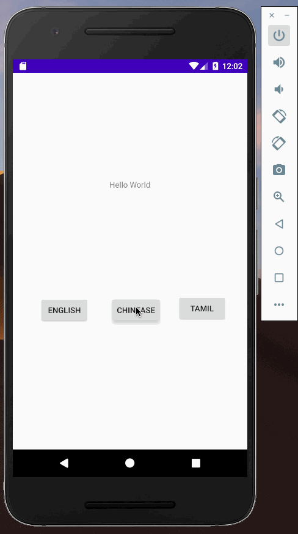

# **Section 2**

## Multilingual Android App

## Tech Stack

- Android App build using **Kotlin**

## Design of the software

- Multi-lingual support using android **Localization**
- Using string.xml and other languages supported with respective string.xml
- Downloading of localization will be supported using [**Android App Bundles** link](https://developer.android.com/platform/technology/app-bundle)
- No source code change required using App bundles approach.

#### Pros

- Reduction in APK file size
- Downloading in low-bandwidth regions is easy
- More features can be added to core app
- Supported by Android, so it will be safe for maintenance and extension of the software.

#### Cons

- Some edge cases will be left out, like multiple language support at the same time
- When the device language changes, then user needs to download the language.

## Alternative approaches

##1. Re-String

- Replacing bundled String dynamically
- Open source implementation [link](https://github.com/hamidness/restring)
- Above library in Java did not work with latest version of Android/Kotlin.

##2. Building your own String resource repository

- Only possible for big Android team to build and maintain with backword compability.
- Discussion on this can be found [here](https://www.reddit.com/r/androiddev/comments/740tju/pros_and_cons_of_dynamic_fetch_of_localized/)

##3. Using React Native

- Localization JSON file can be sent from server
- RN [Codepush](https://www.npmjs.com/package/react-native-code-push) can solve this.
- This approach was not used as the problem clearly specified to used Android resources like string.xml and layout.
